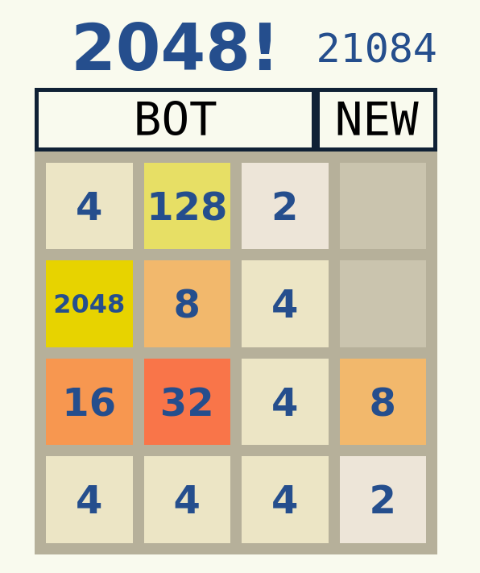

# 2048 with Bot
An implementation of the game [2048 by Gabriele Cirulli](https://gabrielecirulli.github.io/2048/) using Angular 6. This 
implementation comes along with a AI solver built using expectimax algorithm with a depth limit of 5 and a simple heuristic function.

## Demo
Watch the working of the bot [here](./2048.mp4).

Check it out for yourself [here](https://aravindvasudev.github.io/2048/).

## Contribute
You are always welcome to open an issue or provide a pull-request!

## License
Built under [MIT](./LICENSE) license.